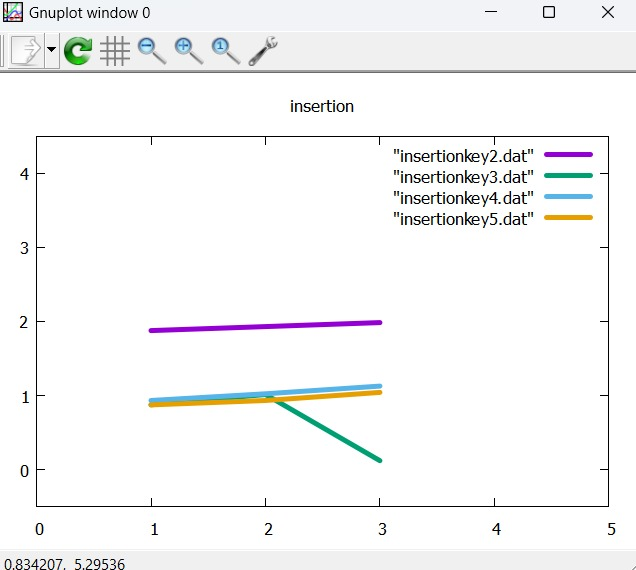
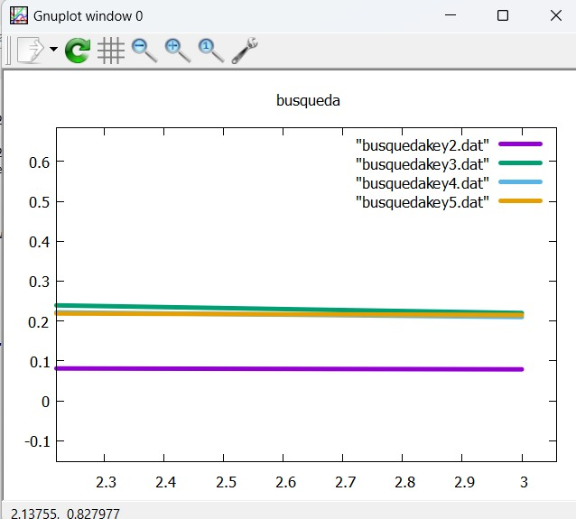

# Informe del Trabajo Grupal - [B-tree]

## 1. Nombre de los Integrantes / Fecha / Link 

**Integrantes**:
- **Basurco Monrroy Luis Gonzalo**
- **Marquez Zuñiga Johan Leonardo**
- **Sanz Palomino Facundo Alejandro**

- **Fecha**: [04/11/2024]
- **Link de codigo**: [https://github.com/bolsadepapas/EstrurturaDat.git]

---

## Indice de contenidos 
- [1. Marco Teorico](#1-marco-teorico)
  - [¿Qué es un B-tree?](#qué-es-un-b-tree)
  - [Propiedades](#propiedades)
  - [Aplicaciones](#aplicaciones)
- [2. Explicación del Problema](#2-explicación-del-problema)
- [3. Lógica Base](#3-lógica-base)
- [4. Código usando Funciones principales brindadas por el docente / comentarios](#4-código-usando-funciones-principales-brindadas-por-el-docente--comentarios)
  - [createNode()](#createnode)
  - [insert()](#insert)
  - [splitChild()](#splitchild)
  - [insertNonFull()](#insertnonfull)
  - [insertKey()](#insertkey)
- [5. Implementación de Funciones adicionales / comentarios](#5-implementación-de-funciones-adicionales--comentarios)
  - [Search](#search)
- [6. Output/Consola](#6-outputconsola)
- [7. Gráfico de Comparación de los tiempos de búsqueda con variación en el (N) llaves](#7-gráfico-de-comparación-de-los-tiempos-de-búsqueda-con-variación-en-el-n-llaves)
- [8. Conclusiones y Recomendaciones](#8-conclusiones-y-recomendaciones)

---


## 1. Marco Teorico 

### ¿Qué es un B-tree?
Un **B-Tree** "árbol B" Es una estructura de datos que organiza información de manera ordenada y jerárquica, optimizada para acceder y manejar grandes volúmenes de datos. Los B-Trees son muy útiles para sistemas donde se necesita realizar muchas búsquedas, ya que mantienen los datos de forma balanceada, lo que permite acceder a ellos rápidamente sin necesidad de recorrer todo el árbol. Cada nodo en un B-Tree puede contener múltiples claves (valores) y múltiples enlaces a otros nodos, lo que hace que esta estructura sea más eficiente para almacenar datos en dispositivos de almacenamiento como discos duros.

### Propiedades
- **Niveles**: Todas las hojas están al mismo nivel.
- **Grado minimo**: Definido por un valor mínimo b.
- **Número máximo de claves**: Todos los nodos pueden contener hasta 2*b - 1 claves.
- **Relación hijos-claves**:  El número de hijos de un nodo es igual a su número de claves más 1.


### Aplicaciones
- **Ingeniería y Sistemas de bases de datos**: Los B-trees se usan ampliamente en bases de datos para organizar y acceder eficientemente a grandes volúmenes de datos almacenados en disco.

- **Sistemas de archivos**: Los sistemas de archivos en sistemas operativos utilizan B-trees para gestionar y localizar archivos de manera eficiente. Al almacenar las ubicaciones de bloques de datos en un B-tree, los sistemas de archivos pueden realizar búsquedas rápidas y mantener la estructura de los datos bien organizada, lo cual es esencial para el acceso rápido a archivos y la optimización del espacio en disco.

---
## 2. Explicación del Problema 


El objetivo de este proyecto es implementar un programa en C++ que calcule el tiempo de que se demora en encontrar un dato en especifico de dentro de los un millon de datos cargados y ordenados en el b-tree. 


---
## 3.Logica Base

En el siguiente segmento de codigo podemos ver la estructura que el docente proporciono  **Laboratorio - B-tree (Parte01)**: 
```cpp
#define MAX_KEYS 4

struct BTreeNode {
  int num_keys;
  int keys[MAX_KEYS];
  struct BTreeNode *children[MAX_KEYS + 1];
};
```
- Tenemos que el "MAX_KEYS" puede ser modificado para indicar el numero maximo de llaves que pueden entrar en una hoja que forma parte del arbol. 

## 4. Codigo usando Funciones principales brindadas por el docente / comentarios

**createNode()** 
```cpp
struct BTreeNode *createNode() {
  struct BTreeNode *newNode =
      (struct BTreeNode *)malloc(sizeof(struct BTreeNode));
  if (newNode == NULL) {
    printf("La asignación de memoria falló.\n");
    exit(1);
  }
  newNode->num_keys = 0;
  for (int i = 0; i < MAX_KEYS + 1; i++) {
    newNode->children[i] = NULL;
  }
  return newNode;
}
```
**Comentarios** : Crea un nodo que sera la raiz de nuestro arbol y se le asigna un espacio de memoria mediante el uso de la funcion *Malloc*. Tambien inicializa *num_keys* a 0 para indicar que el nodo está vacío, y establece todos sus punteros de hijos a *NULL*. Esto es esencial para empezar a construir el árbol, ya que los nuevos nodos serán la base de la estructura B-tree.
     

**insert()** 
```cpp
void insert(struct BTreeNode **root, int key) {
  if (*root == NULL) {
    *root = createNode();
    (*root)->keys[0] = key;
    (*root)->num_keys = 1;
  } else {
    if ((*root)->num_keys == MAX_KEYS) {
      struct BTreeNode *newRoot = createNode();
      newRoot->children[0] = *root;
      splitChild(newRoot, 0);
      *root = newRoot;
    }
    insertNonFull(*root, key);
  }
}
```
**Comentarios** : Esta función inserta una clave en el B-tree. Si el árbol está vacío (*root == NULL), crea un nuevo nodo como raíz y agrega la clave directamente. Si la raíz está llena (tiene MAX_KEYS), se crea un nuevo nodo raíz y se llama a *splitChild()* para dividir el nodo lleno. Luego, *insertNonFull()* inserta la clave en el lugar adecuado dentro de un nodo no lleno.
     

**splitChild()** 
```cpp
void splitChild(struct BTreeNode *parent, int index) {
  struct BTreeNode *child = parent->children[index];
  struct BTreeNode *newChild = createNode();
  newChild->num_keys = MAX_KEYS / 2;
  for (int i = 0; i < MAX_KEYS / 2; i++) {
    newChild->keys[i] = child->keys[i + MAX_KEYS / 2 + 1];
  }
  if (child->children[0] != NULL) {
    for (int i = 0; i < MAX_KEYS / 2 + 1; i++) {
      newChild->children[i] = child->children[i + MAX_KEYS / 2 + 1];
    }
  }
  child->num_keys = MAX_KEYS / 2;
  for (int i = parent->num_keys; i >= index + 1; i--) {
    parent->children[i + 1] = parent->children[i];
  }
  parent->children[index + 1] = newChild;
  for (int i = parent->num_keys - 1; i >= index; i--) {
    parent->keys[i + 1] = parent->keys[i];
  }
  parent->keys[index] = child->keys[MAX_KEYS / 2];
  parent->num_keys++;
}
```
**Comentarios** :aqui se divide un nodo hijo lleno en dos nodos, ayudando a mantener las propiedades del B-tree. Toma el nodo *child* en parent->children[index] y crea un nuevo nodo *newChild*. La mitad superior de las claves de child se mueve a *newChild*. La clave central se mueve al nodo parent, lo que permite que parent apunte a ambos nodos hijos. Esta función es clave para mantener la estructura del B-tree cuando un nodo alcanza su capacidad máxima de claves.
   
**insertNonFull()** 
```cpp
void insertNonFull(struct BTreeNode *node, int key) {
  int i = node->num_keys - 1;
  if (node->children[0] == NULL) {
    insertKey(node, key);
    return;
  }
  while (i >= 0 && node->keys[i] > key) {
    i--;
  }
  i++;
  if (node->children[i]->num_keys == MAX_KEYS) {
    splitChild(node, i);
    if (node->keys[i] < key) {
      i++;
    }
  }
  insertNonFull(node->children[i], key);
}
```
**Comentarios** : en esta funcion se inserta una clave en un nodo que no está lleno. Si el nodo es una hoja, llama a *insertKey()* para insertar la clave directamente. Si no es una hoja, busca el hijo adecuado donde debe insertarse la clave. Si el nodo hijo está lleno, llama a *splitChild()* para dividir el nodo antes de proceder con la inserción en el nodo adecuado. Este método asegura que la clave se inserte en el lugar correcto sin violar las restricciones de un B-tree.
     
**insertKey()** 
```cpp
void insertKey(struct BTreeNode *node, int key) {
  int i = node->num_keys - 1;
  while (i >= 0 && node->keys[i] > key) {
    node->keys[i + 1] = node->keys[i];
    i--;
  }
  node->keys[i + 1] = key;
  node->num_keys++;
}
```
**Comentarios** : inserta una clave en un nodo que tiene espacio disponible, desplazando las claves mayores hacia la derecha para hacer lugar a la nueva clave en su posición ordenada. Este método se usa cuando la clave se agrega directamente en un nodo hoja, manteniendo el orden ascendente de las claves en el nodo y aumentando el contador de claves.

## 5. Implementacion de Funciones adicionales / comentarios 

**Search** 
```cpp
// Implementación de la función de búsqueda
bool search(BTreeNode *node, double key) {
    int i = 0;
    while (i < node->num_keys && key > node->keys[i]) {
        i++;
    }

    if (i < node->num_keys && node->keys[i] == key) {
        return true;
    }

    if (node->children[0] == nullptr) {
        return false;
    }

    return search(node->children[i], key);
}

```
**Comentarios** : Esta función search busca una clave en el B-tree de manera recursiva. Comienza en el nodo actual y recorre sus claves para encontrar la posición donde la clave podría estar. Si encuentra la clave, devuelve true. Si el nodo es una hoja y no contiene la clave, devuelve false. Si el nodo no es una hoja, llama recursivamente a search en el hijo correspondiente, donde la clave podría estar de acuerdo con el orden del B-tree.
    
## 6. Output/Consola.
```py
PS C:\Users\facun\B-tree> .\searchtime.exe
Se han insertado 1000000 claves en el B-tree.
Tiempo de inserción de todos los valores: 3.82258 segundos.
Ingrese el valor a buscar en el B-tree: 0.7710434640053802
Valor encontrado en el B-tree.
Tiempo de búsqueda: 1.2e-06 segundos.
```
- Al terminar todos los datos son guardados en un .txt para posteriormente poder hace una grafica de comparacion


## 7.Grafico de Comparacion de los tiempos de busqueda con variacion en el (N) llaves : 


- En este primer caso, se muestra el tiempo de insecion en general del millon de datos en el B-tree, la herramienta usada es GNUplot: 


- En este segundo caso, se muestra el tiempo de busqueda de un dato "N" dentro del millon de datos variando el numero de llaves maxima del B-tree: 


## 8. Conculsiones y Recomendaciones  

**Conclusiones**
- En conclusión, el B-Tree es una estructura de datos altamente eficiente y versátil, ideal para sistemas que manejan grandes volúmenes de información, como bases de datos y sistemas de archivos. Su diseño balanceado y su capacidad para almacenar múltiples claves en cada nodo permiten realizar operaciones de búsqueda, inserción y eliminación de manera rápida, lo cual optimiza el acceso y la organización de datos en memoria o en almacenamiento secundario. Gracias a estas características, los B-Trees son fundamentales en el desarrollo de aplicaciones de alto rendimiento que requieren una gestión de datos ordenada y escalable

**Recomendaciones**
- Para poder entender el contenido de este documento, es necesario revisar algunas fuentes de informacion externa, ya que hay algunos datos o informacion que puede ser abrumante para alguien que no este dentro del campo de Ing.Software. 

- Para los desarroladores se recomienda la constante mejora del codigo, la importancia radica en encontrar poco a poco una cercania con la perfeccion, es por eso que se recomienda la mejora del mismo


---